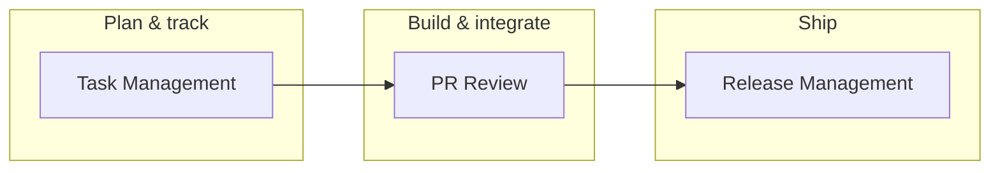

# AiNative

**Your technical operating system** — workflows, templates, and guides for how you build, review, ship, and lead as a developer/manager on the technical layer.

Use it yourself first. Refine it in real work. Then bring the same playbook to each team you join.

---

## What this is

AiNative is not an application (yet). It is a **living system of practices** you implement in tools you already use: Git, GitHub, Cursor, boards, docs, and team rituals.

It covers the work you repeat on every team:

| Area | What you get |
|------|----------------|
| **Task management** | How work is captured, prioritized, moved, and finished |
| **PR review** | Structured, AI-assisted review without noise |
| **Release management** | Safe, predictable path from feature branch to production |
| **Programming & setup** | Project lifecycle, stack choices, Cursor/MCP/rules, commands, references |

Each piece is written to be **universal** (web, backend, SaaS, WordPress, etc.) and **lightweight** — enough process to improve delivery, not enough to slow people down.

---

## Who this is for

- **You** — hybrid developer/manager owning the technical layer
- **Small teams** — startups, freelance squads, internal product groups
- **Future teams** — same system, adapted per context with templates and setup guides

---

## Rollout model

```text
Phase 1 — Personal (you)
  Run every workflow on your own repos and side projects.
  Fix friction, drop what you do not use, tighten templates.

Phase 2 — Pilot (one team)
  Introduce one system at a time (e.g. task board → PR review → release).
  Document what changed for that stack and team size.

Phase 3 — Repeat (each new team)
  Copy the template bundle, run the setup guide, tune labels/WIP/rules.
  Keep team-specific notes beside the universal docs.
```

**Rule:** Nothing ships to a team until you have used it yourself for at least one real delivery cycle.

---

## How the systems connect



1. **Tasks** move through a clear board (backlog → released) with ownership, WIP limits, and weekly planning/review.
2. **PRs** leave “In Progress” only after self-test and a staged review (understanding → risk → deep dive → human decision).
3. **Releases** follow a fixed branch flow: `feature/*` → `development` → staging → `master` → production.

Deeper detail lives in each guide below.

---

## Documentation map

| Document | Purpose |
|----------|---------|
| [task-management-system.md](./task-management-system.md) | Board columns, task templates, priorities, WIP, weekly meetings, team rules |
| [pr-review-system.md](./pr-review-system.md) | Cursor/AI PR review phases, prompts, and human-in-the-loop judgment |
| [release-management-system.md](./release-management-system.md) | Branch model, release phases, checklists, hotfix path |
| [Programming Documentation.md](./Programming%20Documentation.md) | New-project process, stack/setup, dev phases, tools, commands, AI workflow |

The [`docs/`](./docs/) folder is reserved for **team-specific** material: setup runbooks, adapted checklists, and notes after each rollout.

---

## Core principles

These apply across every document in the repo:

1. **Simplicity over complexity** — if a step feels annoying, simplify or remove it.
2. **Visibility over memory** — tasks, blockers, releases, and decisions should be written down.
3. **Finish before you start** — fewer parallel items, smaller tasks, clearer done states.
4. **AI as partner, not authority** — especially in review; you own the merge and the release.
5. **One feature, one branch** — keeps integration and releases predictable.

---

## Getting started (personal)

1. **Pick one workflow** — start with [task-management-system.md](./task-management-system.md) on a single board (GitHub Projects, Linear, Notion, etc.).
2. **Align Git** — use the branch names in [release-management-system.md](./release-management-system.md) on one repo.
3. **Use PR review on your next change** — follow [pr-review-system.md](./pr-review-system.md) in Cursor before asking anyone else to look.
4. **Log gaps** — anything you do repeatedly but is not documented yet belongs in this repo (new `.md` or under `docs/`).

After two weeks, add the next system. Do not introduce everything at once.

---

## Getting started (team)

When you onboard a team:

1. Share only the systems you already run personally.
2. Add a short `docs/<team-name>/` page: stack, branch names, board tool, meeting day/time, who approves releases.
3. Run a **Monday planning** and **Friday delivery review** using the cadence in the task guide.
4. Iterate in the retro; update the team doc, not necessarily the universal templates.

---

## Roadmap (intended growth)

- [ ] Team setup templates (Cursor rules, MCP, repo scaffolding)
- [ ] Technical manager playbook (1:1s, escalation, cross-team alignment)
- [ ] Onboarding checklist per stack (e.g. Node, PHP/WordPress, mobile)
- [ ] Metrics that matter (cycle time, review time, release frequency) without heavy tooling

Contributions here are **your own notes evolving into team standards** — versioned in git, not locked in a SaaS.

---

## Repository layout

```text
AiNative/
├── README.md                      # This file — vision and index
├── task-management-system.md      # Engineering task workflow
├── pr-review-system.md            # AI-assisted PR review
├── release-management-system.md   # Release and branching workflow
├── Programming Documentation.md   # Broader dev reference and processes
└── docs/                          # Per-team setup and execution notes
```

---

## License & usage

Private working system. Use, copy, and adapt per team. When a practice is stable, keep the universal doc generic and push team quirks into `docs/`.

---

*AiNative — implement for yourself, then make every team you touch faster to understand, review, and ship.*
