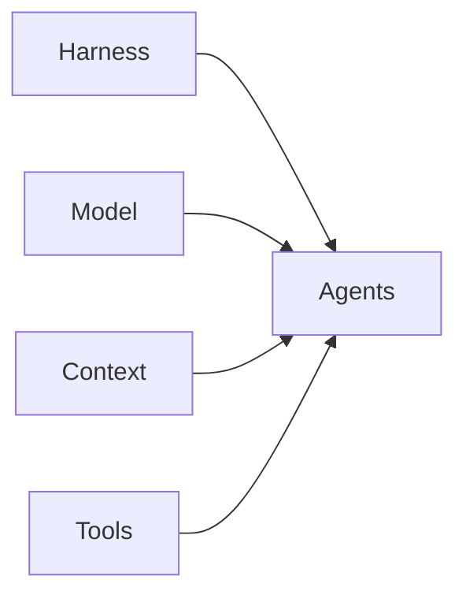

# Agentic system

Every agentic system has five parts. AiNative documents each part in one canonical location — tune the parts independently as models, tools, and workflows evolve.

| Part | What it is | Where in this repo |
|------|------------|-------------------|
| [Harness](#1-harness) | Runtime environment where agents run | [harness.md](../3.%20reference/setup/harness.md) |
| [Model](#2-model) | Which LLM for which phase | This doc § Model; Validation: [validation-layer.md](./validation-layer.md#model-selection) |
| [Context](#3-context) | What the model sees — rules, specs, docs | [agentic-coding.md](./agentic-coding.md) § AI layer; project `.cursor/rules/` |
| [Tools](#4-tools) | What the agent can invoke beyond the model | MCP + terminal — [cursor-setup.md](../3.%20reference/setup/cursor-setup.md) |
| [Agents](#5-agents) | Per-task workflows and prompts | [8. agents/](../8.%20agents/) |

Methodology for building with agents: [agentic-coding.md](./agentic-coding.md) (PIV — Plan, Implementation, Validation). The AI layer in that doc is **Context**; PIV phases map to **Agents**.

---

## 1. Harness

The environment agents run in — not the model, not the prompts.

**Stack:** Tmux + Cursor CLI.

**Layout:** One tmux session per project, one window, three panes left to right:

| Pane | Role |
|------|------|
| Agent | Cursor CLI — PIV agents (`/specsmd-fire-planner`, `/critic`, etc.) |
| Terminal | Shell work — git, scripts, one-off commands |
| Services | Long-running project processes — dev server, `docker compose`, watchers |

Setup and session conventions: [harness.md](../3.%20reference/setup/harness.md).

---

## 2. Model

Model choice is a system decision, not a default. Use different tiers for different work — and a **different model** for Validation than for Plan or Implementation ([validation-layer.md](./validation-layer.md#model-selection)).

Model names change as providers ship newer versions. The **roles** stay stable; update the current picks when you switch.

| Tier | Role | Use for | Current picks |
|------|------|---------|---------------|
| **1 — Reasoning** | Planning, complex reasoning, interrogation | PIV Plan, ambiguous multi-file work, architecture decisions | Grok or GLM |
| **2 — Implementation** | Solid coding without full planning overhead | PIV Implementation, medium/small features, bounded changes | DeepSeek Pro |
| **3 — Execution** | Fast, cheap passes | Repetitive execution, small edits, high-volume loops | Composer or DeepSeek Flash |

**Rules:**

- Tier 1 is for reasoning — not execution or bulk implementation.
- Tier 2 handles implementation when blast radius is bounded; escalate to Tier 1 + full PIV when touching many files or unclear requirements.
- Tier 3 is for speed-sensitive execution — not planning or adversarial review.
- Critic and tester run on a model **distinct** from Plan and Implementation — new chat, different tier.

---

## 3. Context

What fills the context window — rules, project standards, and selectively loaded docs.

**Specs.md AI layer** — markdown about the project (standards, conventions, codebase map) plus progressive disclosure:

1. Index file + detail files so agents load only what they need.
2. Each detail file maps to a specific part of the code.
3. Keep files small — context window is for coding, not dumping the repo.

**Cursor rules** — `.cursor/rules/` (`engineering-os.mdc`, `ai-rules.mdc`, `Commit-style.mdc`, `piv-gate.mdc`). A bad rule produces bad code across all features; grow rules when agents repeat the same mistake.

**Indexing** — index the repo for `@codebase`; prefer `@files` over whole-repo scans. See [cursor-setup.md](../3.%20reference/setup/cursor-setup.md#indexing-and-docs).

Full Context guidance (progressive disclosure, MCP context discipline, terminal-as-environment): [agentic-coding.md](./agentic-coding.md) § AI layer.

---

## 4. Tools

What agents invoke beyond generation — scoped narrowly so context stays clean.

| Tool | Scope | Setup |
|------|-------|-------|
| **MCP** | External capabilities — database, Stripe, Firebase, etc. | [cursor-setup.md](../3.%20reference/setup/cursor-setup.md#mcp) |
| **Terminal** | Shell commands, git, scripts, local toolchain | Harness terminal pane; agent shell access in Cursor CLI |

When using MCP, avoid poorly scoped server handling that fills context with tool metadata. Browser/E2E and other tools may be added here as the system grows.

---

## 5. Agents

Per-task workflows — each agent is a folder with `agent.md`, `skill.md`, and `rule.md`.

| Agent | PIV phase | Command |
|-------|-----------|---------|
| [specs-planner](../8.%20agents/specs-planner/) | Plan + Implementation | `/specsmd-fire-planner`, `/specsmd-fire-builder` |
| [critic](../8.%20agents/critic/) | Validation (review) | `/critic` |
| [tester](../8.%20agents/tester/) | Validation (execute) | `/tester` |
| [pr-reviewer](../8.%20agents/pr-reviewer/) | After Validation | `/pr-reviewer` |
| [task-groomer](../8.%20agents/task-groomer/) | Backlog / meetings | `/task-groomer` |
| [project-bootstrapper](../8.%20agents/project-bootstrapper/) | New project setup | `/project-bootstrapper` |

Agent library and file contract: [8. agents/README.md](../8.%20agents/README.md).

PIV methodology (Plan → Implementation → Validation loops, handoffs, commit plan): [agentic-coding.md](./agentic-coding.md).

---

## Related

- [9. evaluations/](../9.%20evaluations/) — candidates to test before updating Model, Tools, or Agents tables above
- [agentic-coding.md](./agentic-coding.md) — PIV methodology and AI layer (Context)
- [validation-layer.md](./validation-layer.md) — Validation architecture and model separation
- [agent-handoff-template.md](./agent-handoff-template.md) — structured handoffs between agents
- [harness.md](../3.%20reference/setup/harness.md) — Tmux + Cursor CLI layout
- [cursor-setup.md](../3.%20reference/setup/cursor-setup.md) — MCP, rules, commands, indexing
