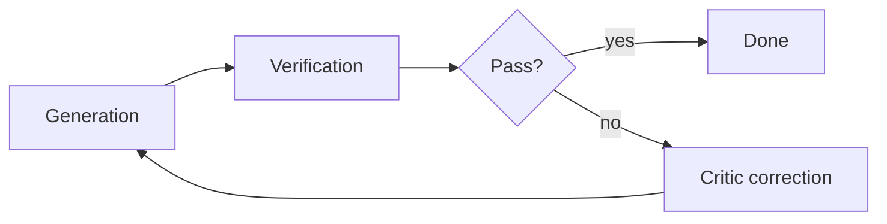

# Validation layer

Technical guide for the PIV **Validation** phase — local, independent validation for agentic E2E testing. Methodology context: [agentic-coding.md](./agentic-coding.md). Agents: [critic](../8.%20agents/critic/) (evaluator) and [tester](../8.%20agents/tester/) (executors).

By separating executor and evaluator roles behind deterministic quality gates, Validation bridges non-deterministic generative AI and strict software engineering requirements.

---

## Multi-agent workflow

Effective E2E testing in an agentic environment requires specialized task distribution. Following the principle of **separating agent memories**, each step carries fewer input tokens — lower latency, lower cost, and less context noise.

### Tester agent (executors)

The [tester](../8.%20agents/tester/) agent runs two sub-specialized passes. Do not combine them in one chat.

| Sub-role | Focus |
|----------|-------|
| **Unit tester** | Isolated component validation — write and debug unit tests for specific functional blocks |
| **System tester** | Full integration and E2E paths — interact with the local environment, validate networking and cross-component logic |

### Critic agent (evaluator)

The [critic](../8.%20agents/critic/) agent is the independent validation layer. It reviews executor output **without executing code**.

| Responsibility | What it checks |
|----------------|----------------|
| Logic critique | Non-conformant logic or strategic flaws in test scripts |
| Feedback iteration | Granular enhancement suggestions from the Observe phase |
| Requirement verification | Generated scripts align with the Plan artifact and architectural specs |
| Heuristic risk | Failure modes static analysis misses (see [Heuristic risk](#heuristic-risk-and-threat-modeling)) |

### Why separate roles

- **Memory optimization** — smaller context per step
- **Focused tasks** — each agent optimizes for one domain
- **Hallucination mitigation** — independent evaluation breaks self-reinforcing reasoning errors

---

## Deterministic stack

Agents must be grounded in a **pinned, deterministic** environment so outputs are reproducible. Pin OS, runtime, and toolchain versions in the project repo (e.g. `Dockerfile`, `.nvmrc`, `mise.toml`).

### Quality gates

| Deterministic input | Expected output | Technical requirement |
|---------------------|-----------------|------------------------|
| Code structure and types | Language-standard conformity | Static analysis and mandatory type checks |
| Upstream definitions | Dependency resolution | Map all local code definitions the tests touch |
| Execution environment | Successful sandbox run | Run inside the pinned container or local dev shell |
| Schema compliance | Sanitized structured response | Validate agent output against expected JSON/schema before the next stage |

Projects choose their own stack. A reference implementation might pin Debian 12, a local API server for kernel communication, and workspace-local dependency lookup — document the chosen pins in project setup docs, not here.

---

## AI-assisted layer

The AI-assisted layer handles intent alignment and surfaces non-obvious failure modes through reflection and observation.

| Phase | Behavior |
|-------|----------|
| **Reflection** | Executor agents review their own output and iterate on self-feedback before handing to the critic |
| **Observation** | Compare outcomes against expected behavior on the Think → Act → Observe cycle |
| **Heuristic risk** | Critic surfaces risks traditional static analysis misses |

### Heuristic risk and threat modeling

One primary heuristic risk in E2E testing is **unauthorized background services** (daemon processes) that tamper with test artifacts or inject malicious links during a session. The critic must flag:

- Persistent processes in writable test directories
- File-structure tampering (e.g. injected URLs in document formats)
- Silent failures where a kernel crashes or times out without a standard exception

---

## Iterative verification loop

Validation runs until the Plan's test flows pass or the task loops back to Plan.

1. **Generation** — unit/system tester writes test code from the action plan and networking requirements
2. **Verification** — execute in the local sandbox; capture results; watch for silent unhandled errors
3. **Correction** — critic analyzes the execution path; if the UI would show a generic fallback message, force re-evaluation of parsing logic to find the root cause

Loop-back rules: [critic rule.md](../8.%20agents/critic/rule.md), [tester rule.md](../8.%20agents/tester/rule.md).

---

## Intent-based test authoring (SDLC for agents)

| Step | Owner | Action |
|------|-------|--------|
| 1. Define requirements | Plan (specs.md) | Document scope, objectives, networking requirements |
| 2. Convert to action plan | Plan (specs.md) | Structured step-by-step technical plan with test flows |
| 3. Write code/tests | Implementation + tester | Functional scripts in the target language |
| 4. Execute tests | tester | Run in pinned environment; capture performance and failure data |
| 5. Fix functional errors | Implementation | Address bugs found during verification |
| 6. Validate E2E | tester + critic | Final pass in end-to-end dev environment |

Steps 3–6 are the PIV Validation phase. [pr-reviewer](../8.%20agents/pr-reviewer/) runs only after Validation passes.

---

## Error handling and schema enforcement

Prevent functional errors from propagating through the pipeline.

### Explicit error handling

Capture and sanitize errors at the execution boundary. The Observe phase must check for exceptions that are swallowed in interactive sessions (e.g. `ValueError`, malformed document relationship warnings) and surface them to the critic.

### Schema enforcement

All agent outputs must conform to expected JSON (or project-defined) formats before passing to the next stage. Non-conformant responses trigger FAIL and Implement loop-back — not generic UI fallbacks.

### Bidirectional input/output validation

Validation is bidirectional: validate inputs before execution and outputs before handoff. For document or file pipelines, the critic checks file-structure integrity to ensure background threads have not tampered with test artifacts.

---

## Diamond testing model

AI-native authoring shifts cost from the traditional **testing pyramid** to the **diamond** model.

In traditional models, E2E tests are minimized because they are slow and expensive to maintain. Multi-agent systems reduce the cost and latency of E2E creation — E2E tests are now as cheap to produce as unit tests.

- **E2E elevation** — E2E becomes a primary tier, not a rare capstone
- **Rapid ROI** — immediate value in complex, evolving codebases where components must meet compliance before "done"

The validation layer is the final quality gate before PR review: every autonomous workflow must reach a deterministic, secure outcome.

---

## Related

| Topic | Location |
|-------|----------|
| PIV methodology | [agentic-coding.md](./agentic-coding.md) |
| Critic prompts | [critic/skill.md](../8.%20agents/critic/skill.md) |
| Tester prompts | [tester/skill.md](../8.%20agents/tester/skill.md) |
| Verification passes (critic) | [_skills/verification.md](../8.%20agents/_skills/verification.md) |
| Test execution (tester) | [_skills/test-execution.md](../8.%20agents/_skills/test-execution.md) |
| Agent handoff | [agent-handoff-template.md](./agent-handoff-template.md) |
