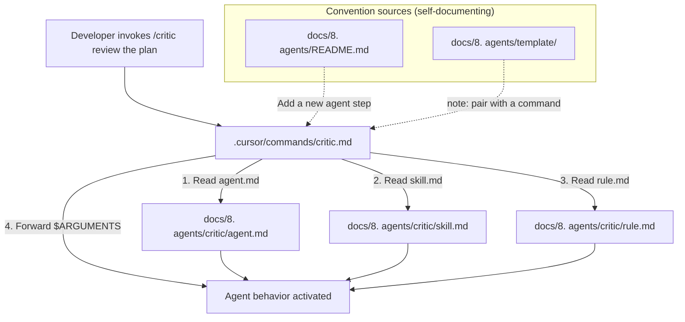

# agent-commands Design Document

## Overview

The solution adds one Cursor command file per in-scope agent under `.cursor/commands/`, plus convention updates to `docs/8. agents/README.md` and `docs/8. agents/template/`. The "technology stack" is Cursor's command-file format (markdown with a yaml frontmatter-style `Command Definition` block), matching the existing `.cursor/commands/specsmd-agent.md`. The architectural style is **thin command → fat agent**: each command is a lightweight loader that points the model at the agent's canonical files (`agent.md`, `skill.md`, `rule.md`) and forwards `$ARGUMENTS`; it never redefines agent behavior. This keeps agents as the single source of truth and makes commands trivial to maintain.

Key design decisions:
- **Path-reference, not copy** — commands reference agent files by path so they never drift from the agent definitions.
- **Filename = agent folder name** — predictable slash-command names (`/critic`, `/tester`, etc.).
- **specs-planner excluded** — specs.md registers its own command on init; the convention note calls this out so future framework-owned agents are also excluded.
- **Self-documenting convention** — the agent template and README "Add a new agent" steps tell future authors to add a command, so the pattern survives new agents.

## Architecture



**Key Architectural Principles:**

- **Thin command, fat agent** — a command's only job is context loading + argument forwarding; behavior lives in the agent folder.
- **Single source of truth** — agent files are never duplicated into commands; the command references them by path.
- **Convention over machinery** — no build step, no generator; a documented convention plus a small parity check keeps commands and agents in sync.
- **Non-destructive** — only additive: new command files + two doc edits. Existing agents and `specsmd-agent.md` are untouched.

## Components and Interfaces

### Command File Schema (per-agent command)

Each command file is a markdown document with three sections, mirroring `specsmd-agent.md`. The schema below is the canonical shape every agent command follows.

**File path:** `.cursor/commands/<agent-name>.md`

**Sections:**
- `# <Agent Name> Command` — title
- `## Command Definition` — yaml block with `name` and `description`
- `## Invocation` — numbered load-context + route-arguments steps
- `## Usage Examples` — at least two examples (no-arg + with payload)

### Command Template (reusable skeleton)

Used to generate each of the five command files. Placeholders are filled per agent.

```markdown
# <Agent Display Name> Command

This file defines the <agent-name> command, which activates the <agent-name> agent.

## Command Definition

\`\`\`yaml
name: <agent-name>
description: <one-line purpose from agent.md first paragraph>
\`\`\`

## Invocation

When this command is invoked, the agent should:

1. **Load Context**
   - Read `docs/8. agents/<agent-name>/agent.md` (purpose, when to use, inputs/outputs)
   - Read `docs/8. agents/<agent-name>/skill.md` (inline skills and prompts)
   - Read `docs/8. agents/<agent-name>/rule.md` (constraints and stop conditions)

2. **Parse Arguments**
   - `$ARGUMENTS` contains user input after the command
   - If empty, determine intent from the agent's "When to use" triggers; prompt the user only if needed

3. **Activate Agent**
   - Adopt the persona and constraints from the loaded files
   - Treat `$ARGUMENTS` as the task input
   - Do not redefine behavior already specified in the agent files

## Usage Examples

\`\`\`text
/<agent-name> <example payload>
\`\`\`

→ <what happens>

\`\`\`text
/<agent-name>
\`\`\`

→ <what happens with no payload>
\`\`\`
```

### Per-Agent Command Files

Five command files are produced from the skeleton, one per in-scope agent:

| Command file | Agent folder | Slash command | `description` (one-line) |
|--------------|--------------|---------------|--------------------------|
| `.cursor/commands/critic.md` | `critic` | `/critic` | Adversarial review of plan and implementation (PIV Validation, first half) |
| `.cursor/commands/tester.md` | `tester` | `/tester` | Prove the code works via the Plan's test flows (PIV Validation, second half) |
| `.cursor/commands/pr-reviewer.md` | `pr-reviewer` | `/pr-reviewer` | Staged PR review — the final gate after Validation passes |
| `.cursor/commands/task-groomer.md` | `task-groomer` | `/task-groomer` | Backlog grooming and Monday/Friday meeting prep |
| `.cursor/commands/project-bootstrapper.md` | `project-bootstrapper` | `/project-bootstrapper` | New-project environment setup from a single spec doc |

### Convention Updates

**`docs/8. agents/README.md`** — two edits:
1. Agents table: add a `Command` column referencing each agent's slash command.
2. "Add a new agent" numbered list: insert a new step (after step 6, "Register the agent in this README table") directing the author to create a matching Cursor Command in `.cursor/commands/<agent-name>.md` using the existing command files as a template, unless the agent is owned by a framework that ships its own command (e.g. specs.md / `specs-planner`).

**`docs/8. agents/template/agent.md`** — append a short section noting that a new agent should be paired with a Cursor Command under `.cursor/commands/`, unless owned by a framework that registers its own command.

### Parity Check (verification helper)

A small, optional shell script `scripts/check-agent-commands.sh` (gitignored output) that verifies command↔agent parity during the validation phase. It is not a runtime dependency — it exists to catch drift when agents are added/removed.

**Logic:**
- For each directory in `docs/8. agents/` except `template` and `_skills`
- Expect a matching `.cursor/commands/<dir>.md`
- Report missing command files and orphaned command files
- Skip `specs-planner` (framework-owned) — encoded in an allowlist

## Data Models

### Command File Structure (TypeScript-style schema)

```typescript
interface AgentCommandFile {
  path: string;           // `.cursor/commands/<agent-name>.md`
  title: string;          // "# <Agent Display Name> Command"
  definition: {
    name: string;         // must equal agent folder name
    description: string;  // one-line purpose, sourced from agent.md
  };
  invocation: {
    loadContext: string[];  // ordered reads: agent.md, skill.md, rule.md
    parseArguments: string[]; // $ARGUMENTS handling + no-payload fallback
    activateAgent: string[];  // adopt persona, forward args, no redefinition
  };
  usageExamples: Array<{
    code: string;     // the `/agent payload` line
    explains: string; // "→ what happens"
  }>; // min length 2, one no-arg + one with payload
}
```

### Convention-State Model

```typescript
interface AgentConventionState {
  agentFolders: string[];       // dirs under docs/8. agents/ minus template, _skills
  commandFiles: string[];       // .md files under .cursor/commands/
  frameworkOwned: string[];     // ["specs-planner"] — excluded from parity
  parity: {
    missingCommands: string[];  // agent folders with no command
    orphanCommands: string[];   // commands with no agent folder
  };
}
```

**Validation Rules:**

- `definition.name`: must equal the agent folder name (lowercase, hyphenated).
- `invocation.loadContext`: must reference `agent.md`, `skill.md`, and `rule.md` by path under `docs/8. agents/<agent-name>/`.
- `usageExamples`: minimum 2; at least one with no payload and one with a payload.
- No command file may be created for an agent in `frameworkOwned`.
- `.cursor/commands/specsmd-agent.md` must remain unchanged.

## Error Handling

### Convention Drift

| Error Type | Condition | Recovery Strategy |
|------------|-----------|-------------------|
| Missing command | Agent folder exists, no `.cursor/commands/<name>.md` | Parity check reports it; author adds the command from the skeleton |
| Orphan command | Command file exists, no matching agent folder | Parity check reports it; author removes the command or restores the agent |
| Framework-owned agent | Agent is owned by specs.md (e.g. `specs-planner`) | Excluded via `frameworkOwned` allowlist; no command created |
| Name mismatch | Command `name` field ≠ agent folder name | Parity/PR review flags it; author renames the command file and `name` |

### Edge Cases

- **Agent folder with no `skill.md` or `rule.md`** — all six current agents have the full contract; the command still instructs the model to read all three. If a future agent omits one, the read step degrades gracefully (Cursor reports the missing file) rather than failing the workflow. Documented as a known acceptable degradation.
- **Multi-step workflow agents** (critic, pr-reviewer, specs-planner) — command usage examples reflect the phases documented in the agent's `skill.md`; the command itself does not encode phases.
- **Payload that looks like a flag** (e.g. `/critic --spec=x`) — forwarded verbatim as `$ARGUMENTS`; the agent interprets it per its own triggers. No command-level flag parsing.

### Recovery Strategies

- **Automatic**: none — commands are static files with no runtime logic, so there is nothing to retry.
- **Drift fallback**: run `scripts/check-agent-commands.sh` (or its inline checklist) before commit/PR to surface missing/orphan commands.
- **User notification**: the parity check prints a clear missing/orphan list with suggested filenames.

## Testing Strategy

This is a config/docs feature, so "testing" is verification of file presence, schema conformance, and parity rather than unit/integration tests against runtime code.

### Unit-Level Verification

- **Command file schema**: each of the five command files contains the three required sections (Command Definition, Invocation, Usage Examples) and the yaml `name`/`description`.
- **Path correctness**: each command's `loadContext` references resolve to existing files under `docs/8. agents/<agent-name>/`.
- **Name match**: each command's `name` equals its agent folder name; filename matches too.

### Integration-Level Verification

- **End-to-end invocation**: in Cursor, run `/critic <payload>` and confirm the model loads `agent.md` + `skill.md` + `rule.md` and behaves as the critic agent (spot-check one agent per workflow role: critic, tester, pr-reviewer).
- **No-payload path**: run `/task-groomer` with no args and confirm the agent prompts/determines intent from its triggers rather than erroring.
- **Convention round-trip**: add a throwaway agent folder, follow the updated "Add a new agent" steps, confirm a command is produced, then remove it and confirm the parity check reports the orphan.

### Test Organization

- **Parity check**: `scripts/check-agent-commands.sh` (optional helper, run manually / in CI).
- **Manual checklist**: documented in `specs/agent-commands/tasks.md` validation step — one row per command verifying schema + path + name.
- No unit-test framework needed (no runtime code introduced).
